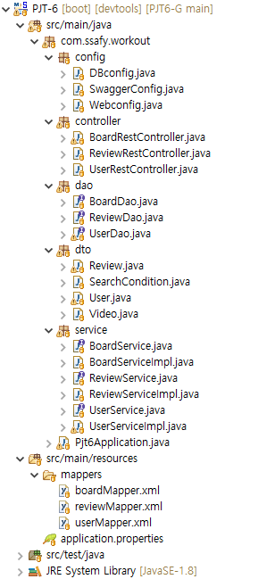

# 관통 프로젝트 6 후기

## 개요
- 이번 관통 프로젝트에서는 Spring Boot를 기반으로 백엔드를 다시 구현해보았습니다.

- 작성정보
    - 작성자 : SSAFY 10기 서울 7반 김태운
    - 개발일시 : 2023-10-06
    - 개발언어 : Java
    - 개발도구 : Spring sts(3.9.14), Google Chrome
    - 그 외 사용 플랫폼 : github

- 과제 세부 내용
    - 지난 시간동안 배운 Spring Boot 라이브러리를 토대로 SSAFIT 사이트의 백엔드 부분을 다시 설계해본다.

## 전체 구조

- Board, Review, User 각 기능별로 Dao, Controller, Service, Mapper를 따로 사용한다.
- RequestMapping을 통해 이 기능의 접근 주소를 차별화했습니다.
- mapper를 이용해 dao를 구현하고, dao를 이용해 service를 완성하고, controller별로 service에 접근합니다.

## 나의 파트 자세한 설명
- 저는 Review와 관련되었던 기능을 모두 구현했습니다.
- Review.java(DTO)를 DB에 맞추어 바꾸었습니다.
- reviewMapper를 이용해 ReviewDao와 DB의 기능을 연동시켰습니다.
- insert, update 때 parameterType을 Review 객체로 일관화시켰습니다.
- Review를 위한 rest controller를 만들었고, /api-review라는 request mapping을 적용했습니다.

## 후기
- 기존에 다른 기술로 구현했었던 것을 Spring으로 옮기려니 여러가지 애로사항이 있었습니다.
- 미리 구현할 기능을 정하고 철저하게 분업화해서 git conflict같은 문제를 방지했습니다.
- 다음 Vue.js 때 프론트를 잘 구현하겠습니다.